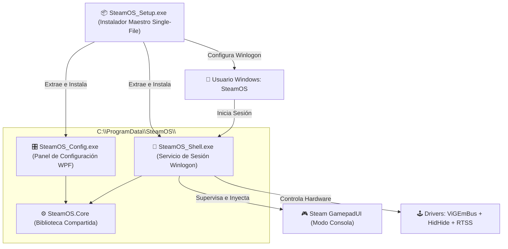

<div align="center">

# 🎮 WindowsLikeSteamOS (WLSteamOS)
### *Transforma cualquier PC o Handheld con Windows 10/11 en una Consola de Videojuegos Dedicada*

[](https://github.com/llromerorr/WindowsLikeSteamOS)
[](https://dotnet.microsoft.com/download/dotnet/8.0)
[](https://docs.microsoft.com/dotnet/csharp/)
[](https://store.steampowered.com/)
[](#)
[](LICENSE)

<br />

<p align="center">
  <b>WindowsLikeSteamOS</b> elimina el escritorio, los procesos innecesarios y las distracciones de Windows, transformando tu equipo en un entorno de juego puro e inmersivo con <b>Steam Big Picture (GamepadUI)</b> como shell principal del sistema. Con aislamiento de pantallas por hardware, emulación de mandos a nivel de kernel, limitación de FPS con latencia ultra-baja y recuperación automática ante cuelgues.
</p>

---

</div>

## 📑 Tabla de Contenidos

1. [✨ Características Principales](#-características-principales)
2. [🏛️ Arquitectura Modular](#️-arquitectura-modular)
3. [🚀 Guía de Instalación y Uso Rápido](#-guía-de-instalación-y-uso-rápido)
4. [🎮 Controles y Atajos de Recuperación](#-controles-y-atajos-de-recuperación)
5. [🔧 Motor de Rendimiento y Tecnologías de Bajo Nivel](#-motor-de-rendimiento-y-tecnologías-de-bajo-nivel)
6. [📂 Estructura del Código Fuente](#-estructura-del-código-fuente)
7. [🛠️ Compilación y Empaquetado](#️-compilación-y-empaquetado)
8. [⚖️ Licencia y Créditos](#️-licencia-y-créditos)

---

## ✨ Características Principales

| Característica | Descripción |
| :--- | :--- |
| 🚀 **Zero-Explorer Boot** | Arranque directo en **Steam Gamepad UI** sustituyendo el shell de Windows (`explorer.exe`) en un usuario aislado. Cero iconos, cero barras de tareas, cero notificaciones. |
| 🎮 **Emulación de Mando Kernel** | Soporte integral de mandos genéricos y DirectInput emulados como **Xbox 360 virtual** mediante `ViGEmBus` y ocultación de hardware físico con `HidHide` para evitar doble entrada. |
| 🖥️ **Aislamiento Quirúrgico de Pantallas** | Desconexión temporal y reconfiguración nativa de monitores secundarios vía Win32 (`ChangeDisplaySettingsEx`) para concentrar el 100% del rendimiento en tu TV o pantalla principal. |
| ⚡ **GPU Scaling & FastSync** | Forzado de escalado en GPU a panel completo (*Full Screen Stretch*) mediante **NVIDIA NVAPI** y sincronización vertical de baja latencia con **NVIDIA Fast Sync**. |
| 🎯 **Limitador de FPS Integrado** | Integración nativa silenciosa con **RivaTuner Statistics Server (RTSS)** y **MSI Afterburner** para bloqueo estricto de framerate con frametimes perfectos. |
| 🔊 **Enrutamiento de Audio Dinámico** | Conmutación automática y gestión de volumen del dispositivo de salida preferido (HDMI, TV, auriculares) vía WASAPI / COM en tiempo real. |
| 🛡️ **Supervisor de Resiliencia** | Máquina de estados reactiva que detecta actualizaciones de Steam, cierres de sesión o bloqueos de juegos, restaurando el foco automáticamente. |
| 🧰 **Menú de Emergencia In-Game** | Menú OSD controlable 100% con el mando para forzar reinicio de Steam, alternar a Modo Escritorio, reparar cliente o restaurar topología. |

---

## 🏛️ Arquitectura Modular

El proyecto está estructurado bajo una arquitectura desacoplada de 4 módulos autónomos sobre **.NET 8.0**:



### Componentes:
* **`src/SteamOS.Core`**: Núcleo unificado de servicios Win32 nativos, P/Invoke, control de energía, hooks de teclado, NVAPI GPU Scaling, WASAPI Audio y puente ViGEmBus.
* **`src/SteamOS.Shell`**: Ejecutable nativo silencioso (sin ventana) que actúa como `Winlogon\Shell` para la cuenta dedicada `SteamOS`.
* **`src/SteamOS.Config`**: Centro de control Fluent WPF con soporte de temas oscuros, selector de pantalla/resolución/audio, calibrador de mando y monitor de dependencias.
* **`src/SteamOS.Installer`**: Asistente de instalación single-file que transporta todos los binarios incrustados y orquesta la creación segura de usuarios, permisos ACL y claves de registro.

---

## 🚀 Guía de Instalación y Uso Rápido

```
  ┌─────────────────────────────────────────────────────────────┐
  │  PASO 1: Descarga y ejecuta SteamOS_Setup.exe como Admin    │
  │  PASO 2: Configura tu pantalla, mando y audio preferido     │
  │  PASO 3: Haz clic en INSTALAR STEAMOS                       │
  │  PASO 4: ¡Inicia sesión en la cuenta SteamOS y a jugar!     │
  └─────────────────────────────────────────────────────────────┘
```

### 1. Requisitos Previos
* **Sistema Operativo:** Windows 10 o Windows 11 (64-bit).
* **Cuenta con Privilegios:** Administrador local de Windows.
* **Cliente:** Steam instalado (o conexión a Internet para descarga automática).
* **Controlador:** Cualquier mando USB / Bluetooth (Xbox, PlayStation, Switch Pro o genérico).

### 2. Instalación
1. Descarga la última versión de **[`SteamOS_Setup.exe`](https://github.com/llromerorr/WindowsLikeSteamOS/releases)**.
2. Ejecuta el archivo como **Administrador**.
3. En la interfaz gráfica:
   * Selecciona tu **Monitor de Juego** y la **Resolución/Tasa de refresco** deseada.
   * Elige tu **Dispositivo de Audio** principal.
   * (Opcional) Ajusta el límite de FPS y activa la emulación de mando si usas un control genérico.
4. Haz clic en **`INSTALAR STEAMOS`** (o **`APLICAR Y DEPLOYAR`**).

### 3. Iniciar el Modo Consola
* Cierra tu sesión actual de Windows o reinicia el equipo.
* Selecciona la cuenta de usuario **`SteamOS`** (o deja que el inicio automático inicie la sesión).
* El equipo entrará directamente a **Steam Big Picture** en pantalla completa.

---

## 🎮 Controles y Atajos de Recuperación

En cualquier momento durante la sesión de juego, puedes utilizar combinaciones de mando o teclado para abrir el **Menú de Recuperación** o volver al escritorio:

### 🕹️ Atajos en el Mando

| Combinación de Botones | Acción |
| :---: | :--- |
| **`Start` + `Select` + `LB` + `RB`** | 🧰 **Abrir Menú de Recuperación OSD** |
| **`Select` + `Start`** (Toque sostenido) | 🔘 **Botón Guía / Home (Abrir Overlay de Steam)** |

### ⌨️ Atajos en el Teclado

| Combinación de Teclas | Acción |
| :---: | :--- |
| **`Ctrl` + `Shift` + `Alt` + `R`** | 🧰 **Abrir Menú de Recuperación** |
| **`Ctrl` + `Shift` + `Alt` + `S`** | 🖥️ **Salida Rápida a Modo Escritorio (`explorer.exe`)** |

---

## 🔧 Motor de Rendimiento y Tecnologías de Bajo Nivel

```
  ┌─────────────────┐       ┌─────────────────┐       ┌─────────────────┐
  │   NVAPI vR380   │       │   WASAPI Audio  │       │    ViGEmBus     │
  │ GPU Full Stretch│       │  COM Controller │       │  Virtual XInput │
  └────────┬────────┘       └────────┬────────┘       └────────┬────────┘
           │                         │                         │
           └────────────────► ⚙️ SteamOS.Core ◄─────────────────┘
                                     │
                    ┌────────────────┴────────────────┐
                    │  Winlogon Native Shell Process  │
                    │      (SteamOS_Shell.exe)        │
                    └─────────────────────────────────┘
```

### 1. 🖥️ Topología de Pantallas & Prevención de Pérdida de Foco
* **Desactivación Temporal:** Al iniciar la sesión, las pantallas secundarias se desconectan limpiamente mediante `ChangeDisplaySettingsEx` con `dmPelsWidth=0, dmPelsHeight=0`.
* **Fuerza de Refresco:** Se bloquea el monitor principal en los Hz exactos configurados antes de que Steam invoque su pipeline gráfico DirectX.

### 2. ⚡ Integración NVAPI & GPU Stretch
* Carga dinámica de `nvapi64.dll` mediante punteros no administrados (`UnmanagedFunctionPointer`).
* Aplica `NvAPI_Disp_SetDisplayConfig` para forzar el escalado en GPU a pantalla completa, eliminando bordes negros y evitando retrasos por reescalado del monitor.

### 3. 🕹️ Emulación XInput Limpia y Sin Conflictos
* Instanciación de gamepad virtual Xbox 360 mediante llamadas directas al controlador `ViGEmBus`.
* Integración con `HidHide` para ocultar el dispositivo DirectInput físico del sistema, asegurando compatibilidad 100% en juegos modernos y emuladores sin doble pulsación.

### 4. 🔋 Gestión de Energía y Estados de Suspensión
* Conmutación automática al plan de energía de **Máximo Rendimiento** (`powercfg`).
* Prevención de suspensión no deseada mediante `SetThreadExecutionState(ES_CONTINUOUS | ES_SYSTEM_REQUIRED | ES_DISPLAY_REQUIRED)`.
* Detección reactiva de mensajes Win32 `WM_POWERBROADCAST` (`PBT_APMRESUMESUSPEND`) para reconstruir el mapeo de mandos y audio tras reactivar el equipo.

---

## 📂 Estructura del Código Fuente

```text
WindowsLikeSteamOS/
├── build.ps1                       # Script maestro de compilación y empaquetado
├── SteamOS.sln                     # Solución integrada de Visual Studio / dotnet
├── src/
│   ├── SteamOS.Core/               # Biblioteca base compartida
│   │   ├── Helpers/                # Win32 API, P/Invoke, DisplayHelper, IconHelper
│   │   ├── Models/                 # Modelos de configuración y mapeo
│   │   └── Services/               # Servicios de Audio, Steam, Instalación, Drivers
│   │
│   ├── SteamOS.Shell/              # Servicio de fondo de sesión (Winlogon Shell)
│   │   ├── Program.cs              # Supervisor del ciclo de vida de Steam y juegos
│   │   └── VentanaRecuperacion.xaml# Menú OSD de emergencia in-game
│   │
│   ├── SteamOS.Config/             # Panel de Configuración Fluent WPF
│   │   ├── MainWindow.xaml         # Interfaz de ajustes de pantalla, audio y FPS
│   │   └── VentanaMapeo.xaml       # Calibrador visual de mando
│   │
│   └── SteamOS.Installer/          # Asistente de instalación single-file
│       └── VentanaInstalador.xaml  # UI con recursos incrustados
└── bin/Release/
    └── SteamOS_Setup.exe           # 📦 Binario autónomo final distribuible
```

---

## 🛠️ Compilación y Empaquetado

Para compilar todo el proyecto y generar el instalador autónomo single-file:

```powershell
# Ejecuta el script de compilación automatizado
powershell -ExecutionPolicy Bypass -File .\build.ps1
```

El instalador final se generará en:
```text
bin\Release\SteamOS_Setup.exe
```

---

## ⚖️ Licencia y Créditos

Este proyecto se distribuye bajo la licencia **MIT**. Consulta el archivo [LICENSE](LICENSE) para más información.

* **ViGEmBus & HidHide:** Nefarius Software Solutions.
* **Wpf.Ui:** Lepoco GUI Framework.
* **AudioSwitcher & SharpDX:** Frameworks de interoperabilidad de medios y DirectX.

<div align="center">
  <sub>Desarrollado con ❤️ para la comunidad de PC Gaming y Handhelds.</sub>
</div>